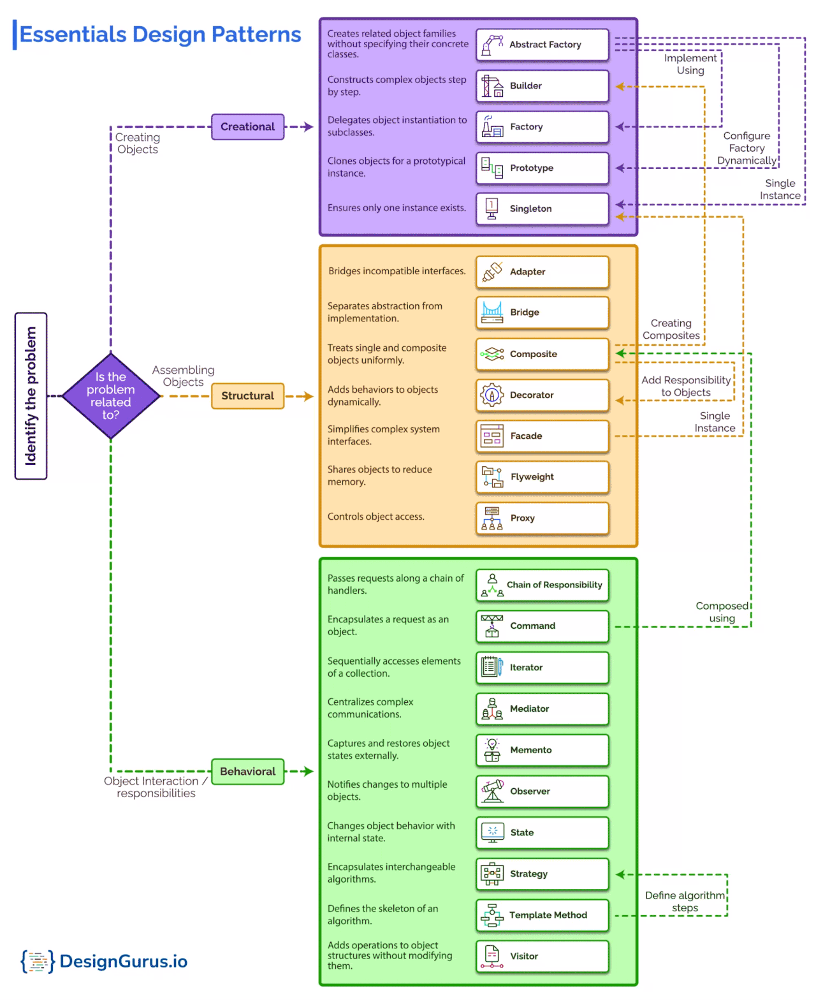

# Java-Design-Pattern
𝗪𝗵𝗲𝗻 𝘁𝗼 𝘀𝗲𝗹𝗲𝗰𝘁 𝗗𝗲𝘀𝗶𝗴𝗻 𝗣𝗮𝘁𝘁𝗲𝗿𝗻𝐬?
Choosing the correct design pattern in software engineering is critical to practical problem-solving.
This post will try to simplify the process, helping you decide between patterns based on specific needs.
To select a pattern, we must first go through the problem identification. If the problem is related to:
🔸 Object Creation? → Creational Patterns
🔸 Object Assembly? → Structural Patterns
🔸 Object Interactions? → Behavioral Patterns
1. Singleton: Ensures only one instance exists.
2. Factory Method: Delegates object instantiation to subclasses.
3. Abstract Factory: Creates related object families without specifying their concrete classes.
4. Prototype: Clones objects for a prototypical instance.
5. Builder: Constructs complex objects step by step.
6. Adapter: Bridges incompatible interfaces.
7. Bridge: Separates abstraction from implementation.
8. Composite: Treats single and composite objects uniformly.
9. Decorator: Adds behaviors to objects dynamically.
10. Facade: Simplifies complex system interfaces.
11. Flyweight: Shares objects to reduce memory.
12. Proxy: Controls object access.
13. Observer: Notifies changes to multiple objects.
14. Strategy: Encapsulates interchangeable algorithms.
15. Command: Encapsulates a request as an object.
16. State: Changes object behavior with internal state.
17. Visitor: Adds operations to object structures without modifying them.
18. Memento: Captures and restores object states externally.
19. Iterator: Sequentially accesses elements of a collection.
20. Mediator: Centralizes complex communications.
21. Chain of Responsibility: Passes requests along a chain of handlers.
22. Template Method: Defines the skeleton of an algorithm.
23. 