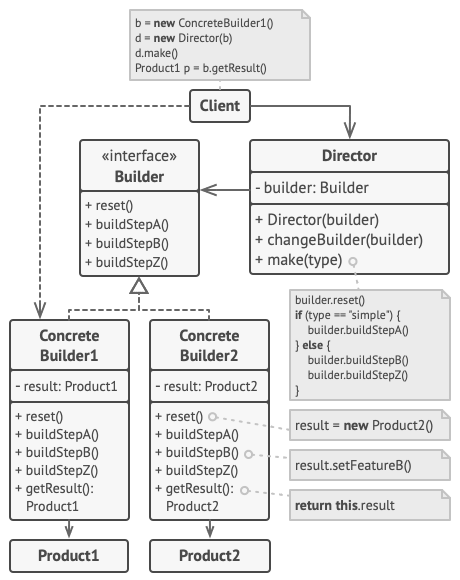
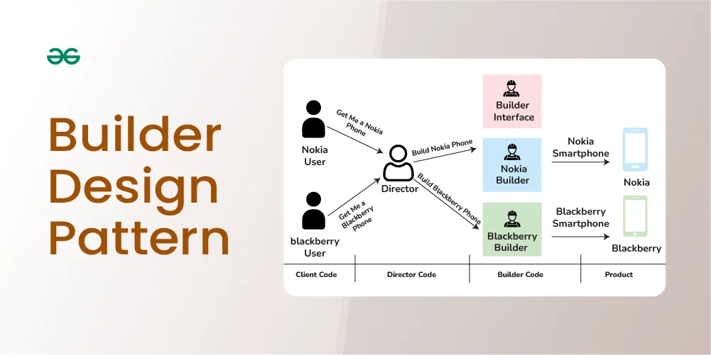

# Builder Design Pattern
---------------------------------------------------------------
## Concept
* Creational Design pattern
* The Builder Pattern separates the construction of a complex object from its representation so that the same construction process can create different representations.
* construct complex objects step by step
* Immutability — All the properties of the Product class are final. They cannot be modified once the object is created. The only constructor is private and takes the builder as a parameter to initialize all the properties of the Product class
* 
* 

## Good to Know

* They can make an API easier to use by clients since the setter methods are self-naming and, therefore, easier to remember.
* The Builder Pattern **enables optional parameters**, something that is offered with telescoping constructors only by using potentially awkward overloading.
* Client code that uses builders can be more self-documenting than code that uses constructors, enabling client code to be easier (and cheaper) to maintain
* The Builder Pattern can reduce bugs. Large lists of identically typed parameters can be accidentally transposed with telescoping constructors. In such a case, the compiler won't report the error and the resulting bugs can be far removed and hard to track down.
* Mandatory parameters for objects can be specified in the constructor signature for the Builder. The compiler will insist that these mandatory parameters are always provided at compile time.
* Useful APIs evolve over time; it is easy to add setter methods to a builder object, while it can be less easy and more error-prone to manage a set of overloaded constructors.
* **The Builder Pattern is concurrency friendly**. It is relatively straightforward to keep the mutable builder object thread confined and, therefore, threadsafe.
## Components of Builder Design Pattern
1. Product
2. Builder - Interface
3. Concrete Builder - interface implementation
4. Director -> where build method is defined
5. Client

## References: 
* https://www.youtube.com/watch?v=7x8iQUv5lcM
* https://www.geeksforgeeks.org/builder-design-pattern/