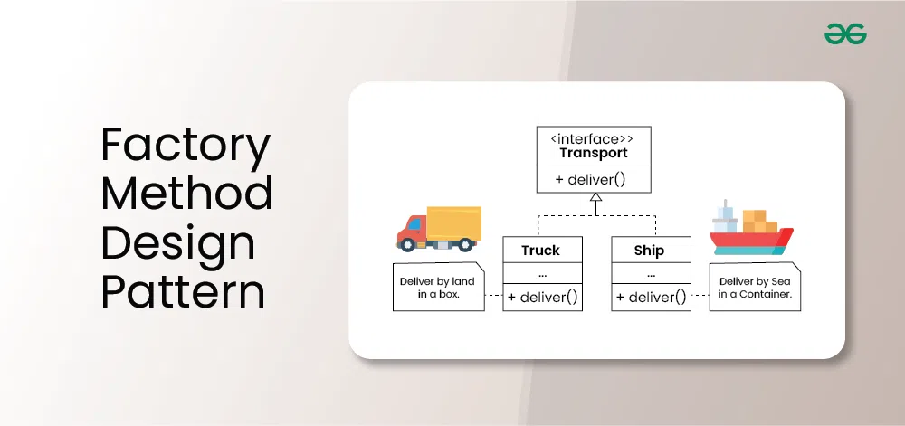

# Factory Design pattern
-
## Concept
* Creational Design pattern
* When there is a superclass and multiple sub classes and we want to make object of subclasses based on the input then factory design pattern is coming in picture 
* 
* If we notice the name Factory method, that means there is a method which is a factory, and in general, factories are involved with creational stuff and here with this, an object is being create
## Good to Know the use case

```python
You are developing a software system for an e-commerce platform that deals with various types of products. Each product category (e.g., electronics, clothing, books) requires specific handling during creation. However, you want to decouple the client code from the concrete product creation logic to enhance flexibility and maintainability. Additionally, you want to allow for easy extension by adding new product types in the future without modifying existing code.
```
## Use Cases of the Factory Method Design Pattern in Java
Here are some common applications of the Factory Method Design pattern in Java:

Creational Frameworks:
1. JDBC (Java Database Connectivity) uses factories extensively for creating connections, statements, and result sets. Dependency injection frameworks like Spring and Guice rely heavily on factories to create and manage beans.
2. GUI Toolkits:
Swing and JavaFX use factories to create UI components like buttons, text fields, and labels, allowing for customization and flexibility in UI design.
3. Logging Frameworks:
Logging frameworks like Log4j and Logback use factories to create loggers with different configurations, enabling control over logging levels and output destinations.
4. Serialization and Deserialization:
Object serialization frameworks often use factories to create objects from serialized data, supporting different serialization formats and versioning.
5. Plugin Systems:
Plugin-based systems often use factories to load and create plugin instances dynamically, allowing for extensibility and customization.
6. Game Development:
Game engines often use factories to create different types of game objects, characters, and levels, promoting code organization and flexibility.
## Components of Builder Design Pattern
1. **Product** - Product Interface : which product object do we need to create
2. **Creator** - Factory Class : it'll contain factory methods to create the object with type of object
3. Product Interface Implementation class : it' contain the implementation of product interface

## When to use Factory Method Design Pattern in Java?
Factory method design pattern can be used in java in following cases:

1.Product A class cannot predict the type of objects it needs to create.
2. A class wants its subclasses to specify the objects it creates.
3. Classes delegate responsibility to one of multiple helper subclasses, and you aim to keep the information about which helper subclass is the delegate within a specific scope or location.

## References: 
*https://www.youtube.com/watch?v=YIB3u0KYrUI